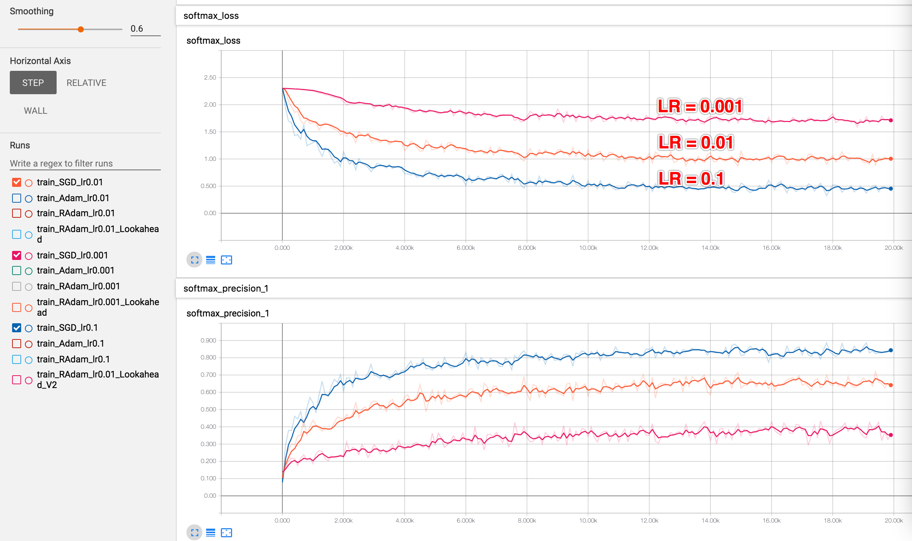
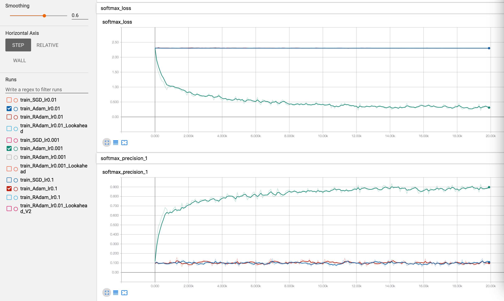
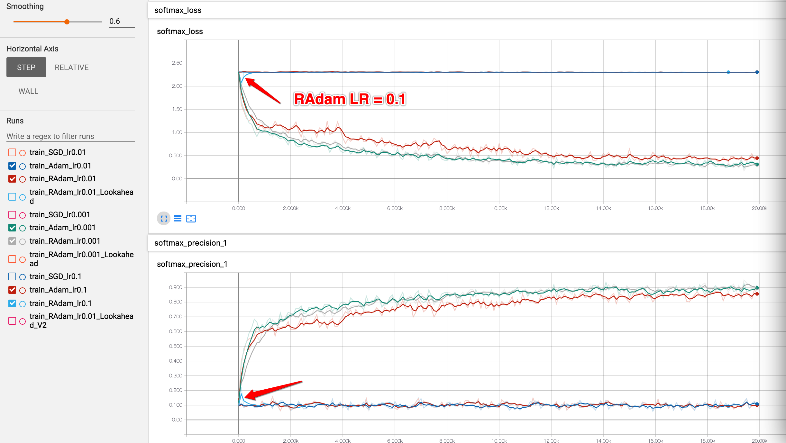
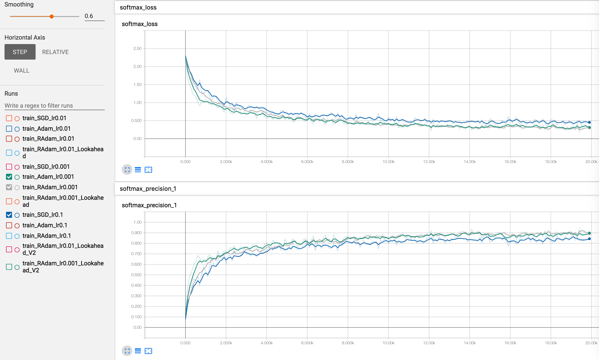
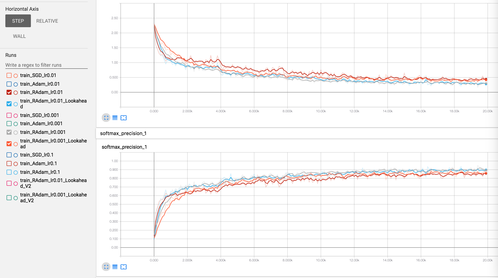

# RAdam & Lookahead Tensorflow Optimizers

## Papers
* RAdam: [On The Variance Of The Adaptive Learning Rate And Beyond ](https://arxiv.org/abs/1908.03265)
	* [official pytorch code](https://github.com/LiyuanLucasLiu/RAdam)
* Lookahead: [Lookahead Optimizer: k steps forward, 1 step back](https://arxiv.org/abs/1907.08610)


## Test on Tensorflow==1.13.1
```
pip install tensorflow-gpu==1.13.1
# If you are in China
pip install -i https://pypi.tuna.tsinghua.edu.cn/simple tensorflow-gpu==1.13.1
```

## Tests
```
python lookahead_optimizer_test.py
python radam_optimizer_test.py
```

## TODOs
* Lookahead: Find a simle way to [init local variables at the first step](https://github.com/lifeiteng/Optimizers/blob/master/lookahead_optimizer.py#L101).

## cifar10 example
* copied and modified from [tensorflow/models](https://github.com/tensorflow/models/tree/master/tutorials/image/cifar10)

```
pip install tensorflow_datasets
# If you are in China
pip install -i https://pypi.tuna.tsinghua.edu.cn/simple tensorflow_datasets

dir=exp/cifar10
mkdir -p $dir

for lr in "0.01" "0.001" "0.1";do
	python cifar10_train.py --learning_rate $lr --optimizer   sgd --train_dir $dir/train_SGD_lr${lr} || exit 1
	python cifar10_train.py --learning_rate $lr --optimizer  adam --train_dir $dir/train_Adam_lr${lr}
	python cifar10_train.py --learning_rate $lr --optimizer radam --train_dir $dir/train_RAdam_lr${lr}
	python cifar10_train.py --learning_rate $lr --optimizer lookaheadradam --train_dir $dir/train_RAdam_lr${lr}_Lookahead
done
```
* 20000 step results
  * SGD likes large learning rate. LR = 0.1 0.01 0.001 
  * Adam is excellent when LR=0.001. LR = 0.1 0.01 0.001 
  * RAdam is not sensitive to learning rate. LR = 0.1 0.01 0.001, but failed when LR=0.1 
  * Best results(SGD LR=0.1, Adam LR=0.001, RAdam LR=0.001) 
  * Lookahead is helpful sometimes. 
  

